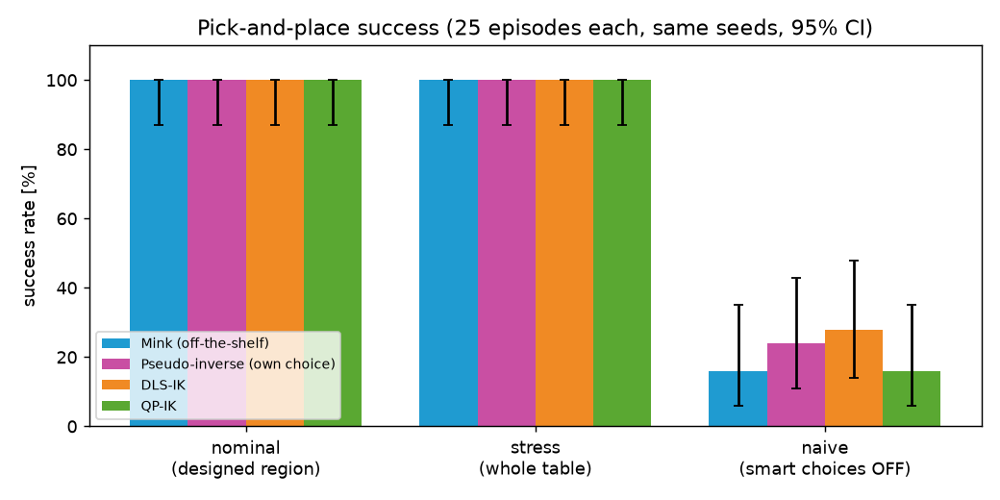
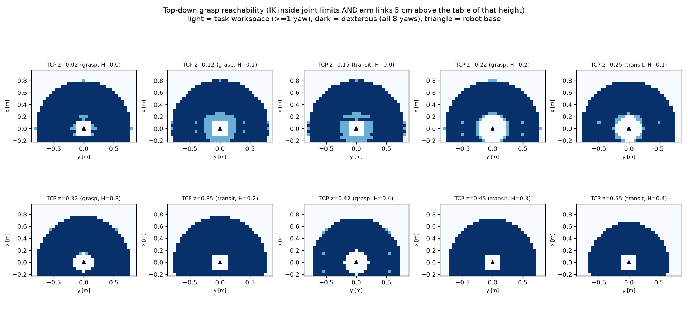
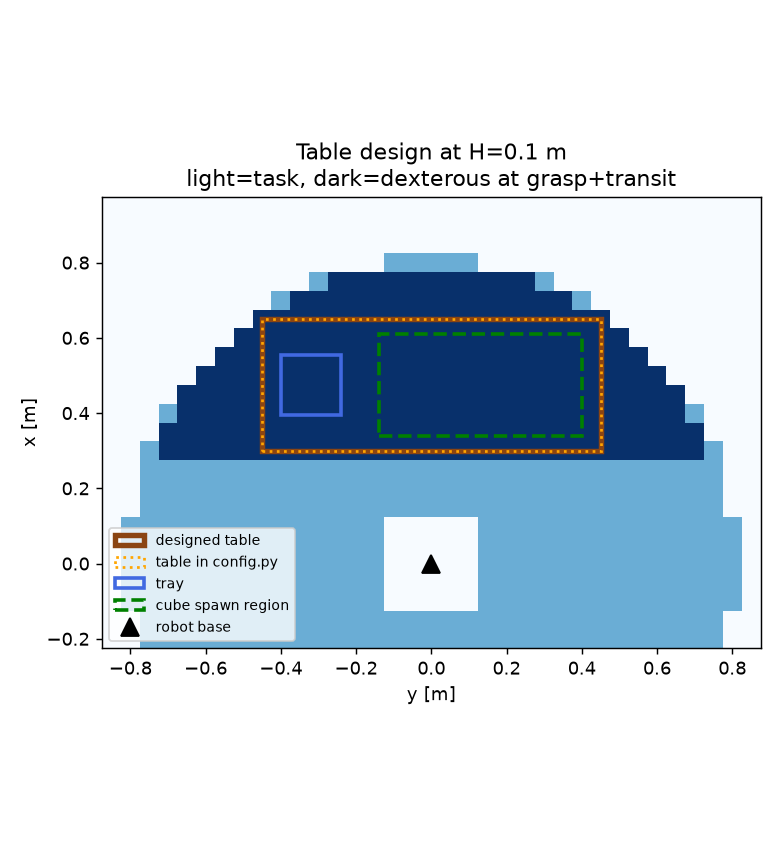
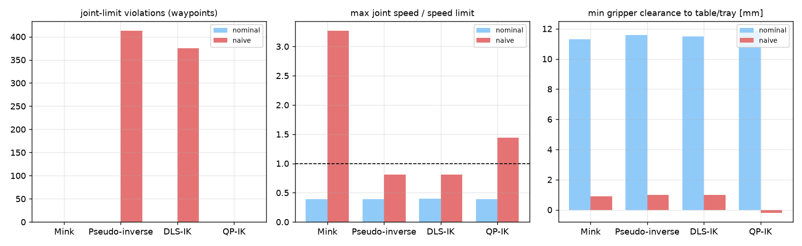
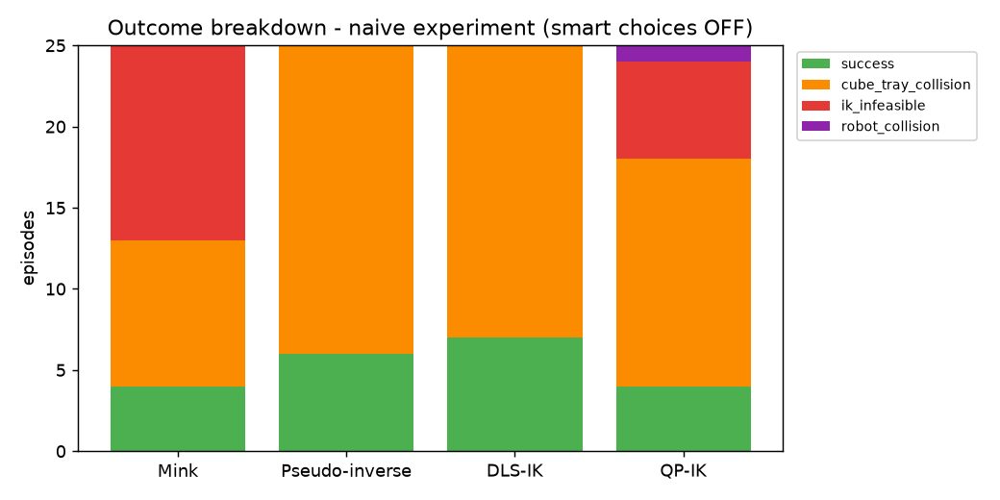

# Tutorial 4 – Pick and Place in MuJoCo with Inverse Kinematics

**Course:** Introduction to Robotics (ITR) **Tutorial author:** Debojit Das
**Student:** `<your name>` **Roll no.:** `<your roll number>`

A **Franka Emika Panda** arm picks up a 4 cm cube placed at a random position and
rotation on a table and drops it into a tray. The motion is planned with
**inverse kinematics (IK)**, solved four different ways, and all methods are compared
on **exactly the same 25 cube poses**.

| IK method | Type | Where |
|---|---|---|
| **Mink** | off-the-shelf library (Stage 1 baseline) – https://github.com/kevinzakka/mink | `ik_solvers.MinkIK` |
| **Pseudo-inverse** | method of choice: Newton–Raphson, `dq = J⁺ K e` | `ik_solvers.PinvIK` |
| **DLS-IK** | damped least squares, closed loop: `dq = (JᵀJ + λI)⁻¹ Jᵀ K e` + null-space joint centring | `ik_solvers.DLSIK` |
| **QP-IK** | DLS cost as a quadratic program with joint-limit and joint-velocity constraints (`quadprog`) | `ik_solvers.QPIK` |

🎥 **Video (3 min, 1 min per IK method):** `<paste your Google Drive / YouTube link here>`

---

## 1. Results at a glance

25 episodes per method, seeds 0–24 (identical cube poses for every method).

| Experiment | Mink | Pseudo-inverse | DLS | QP |
|---|---|---|---|---|
| **Nominal** – cube in the designed spawn region | **100 %** | **100 %** | **100 %** | **100 %** |
| **Stress** – cube anywhere on the table | 100 % | 100 % | 100 % | 100 % |
| **Naive** – smart grasp/transit choices switched off | 16 % | 24 % | 28 % | 16 % |
| Planning time per episode (nominal) | 57 ms | 38 ms | 46 ms | 85 ms |
| IK iterations per waypoint (nominal) | 1.0 | 2.0 | 2.1 | 5.9 |
| Joint-limit violations (naive, waypoints) | 0 | 413 | 375 | 0 |
| Max joint speed / limit (naive) | 3.27 | 0.81 | 0.81 | 1.44 |
| Cube–tray contacts (nominal) | 0 | 0 | 0 | 0 |

**Key finding:** with a workspace-based table design and the grasp/transit strategy,
every method succeeds 100 % of the time. The methods differ in **how they fail**:
* DLS and the pseudo-inverse silently plan **through joint limits**.
* QP and Mink respect the limits and report "IK infeasible" instead.
* Mink also avoids collisions, but once jumped to another arm configuration.

Full table: [`results/summary.md`](results/summary.md)



---

## 2. Installation (Windows PowerShell)

```powershell
python -m venv .venv
.venv\Scripts\Activate.ps1
pip install -r requirements.txt
```
* Python 3.11 or 3.12 is recommended.
* If activation is blocked, run `Set-ExecutionPolicy -Scope CurrentUser RemoteSigned` once.
* Linux/macOS: activate with `source .venv/bin/activate`. On a Linux machine without a
  screen, run `export MUJOCO_GL=egl` first.

**Robot model:** the Franka Panda from
[mujoco_menagerie](https://github.com/google-deepmind/mujoco_menagerie) (Apache-2.0)
goes in `assets/panda/`. If the folder is missing:
```powershell
git clone --depth 1 --filter=blob:none --sparse https://github.com/google-deepmind/mujoco_menagerie.git
cd mujoco_menagerie; git sparse-checkout set franka_emika_panda; cd ..
Copy-Item -Recurse mujoco_menagerie\franka_emika_panda assets\panda
```

---

## 3. How to run

Run every command from this folder with the virtual environment active.

| Step | Command | Time | Output |
|---|---|---|---|
| Test all 4 IK solvers | `python ik_solvers.py` | seconds | 4 × `converged=True` |
| Workspace analysis + table design | `python workspace.py` | ~9 min | `results/ws_*.png`, `results/table_design.md` |
| Re-plot workspace from saved data | `python workspace.py --reuse` | seconds | same plots |
| Watch pick-and-place live | `python pick_place.py --method mink --episodes 3 --viewer` | ~1 min | MuJoCo window |
| Batch run of one method | `python pick_place.py --method dls --episodes 25` | ~1 min | `results/logs_dls.csv` |
| All methods × all experiments + plots | `python compare.py --run` | ~7 min | `results/summary.md`, `results/plots/`, `results/failures/` |
| Record a 1-min video | `python pick_place.py --method qp --episodes 8 --tag _video --video videos\qp_1min.mp4 --video-seconds 60` | a few min | `videos/qp_1min.mp4` |

`pick_place.py` options:

| Option | Meaning |
|---|---|
| `--method mink\|pinv\|dls\|qp` | IK solver to use |
| `--episodes N` | number of episodes |
| `--seed S` | episode *i* uses seed *S + i* (default 0) |
| `--region designed\|full` | cube spawn area: the designed region, or anywhere on the table |
| `--naive` | switch off the smart choices (used for the failure study) |
| `--retries K` | how many alternate grasp yaws to try if planning fails (default 3) |
| `--video file.mp4`, `--video-seconds T` | record a video with the gripper trail drawn in |
| `--viewer` | open the live MuJoCo viewer (macOS: run with `mjpython`) |
| `--tag _x` | suffix added to the log file name |

---

## 4. Project structure

```
├── config.py        all parameters (table, tray, cube, speeds, IK gains)
├── scene.py         builds robot + table + tray + cube with mujoco.MjSpec
├── kinematics.py    FK, 6x7 Jacobian, quaternion orientation error, slerp
├── ik_solvers.py    Mink, Pseudo-inverse, DLS and QP behind one .solve() interface
├── workspace.py     task / dexterous workspace analysis and table selection
├── pick_place.py    planner (IK on Cartesian waypoints), physics execution, checks, logs
├── recorder.py      mp4 recording with the TCP trail and text overlay
├── compare.py       runs all experiments, summary table and comparison plots
├── requirements.txt
├── assets/panda/    Franka Panda model (mujoco_menagerie)
├── results/         plots, logs, summary tables, failure screenshots
└── videos/          one minute per IK method
```

---

## 5. Method

### 5.1 Scene
* **Robot:** Franka Panda, 7 position-controlled arm joints plus a parallel gripper,
  with gravity compensation. A **TCP site** is added 10.34 cm below the hand flange,
  between the finger pads.
* **Simulation:** MuJoCo, 2 ms timestep.
* **Objects:** a 4 cm, 50 g cube with a free joint, and a 16 × 16 cm tray with 5 cm walls.
* Everything is built in Python with `MjSpec` from the numbers in `config.py`.

### 5.2 Workspace analysis and table design (Sections 5–6)
* **Grid:** a 5 cm grid at 10 TCP heights. For each point, a top-down grasp is solved
  at **8 yaw angles** (every 45°) using the QP-IK, which respects the joint limits.
* **Counting rule:** a point counts only if the IK converges **inside the joint limits**
  and the elbow and wrist links stay at least 5 cm above that table.
* **Task workspace:** at least 1 yaw is reachable. **Dexterous workspace:** all 8 yaws
  are reachable.
* **Table choice:** for each candidate height H, the largest rectangle (with x ≥ 0.30 m)
  where *both* the grasp height (H + 0.02) and the transit height (H + 0.15) are dexterous.

| Parameter | Symbol | Value | Rationale |
|---|---|---|---|
| Table length | L | 0.35 m (x 0.30 → 0.65) | largest dexterous rectangle along x, clear of the robot base |
| Table width | W | 0.90 m (y −0.45 → 0.45) | same rectangle along y – any cube yaw can be grasped |
| Table height | H | 0.10 m | largest usable area (0.38 m², tied with H = 0; higher chosen for link clearance); H ≥ 0.2 m shrinks it to 0.34 → 0.23 m² |




### 5.3 Episode and planning (Sections 7–9)
**Cube pose:** sampled from a seed:
* x ∈ [0.34, 0.61] m, y ∈ [−0.14, 0.40] m, yaw ∈ [−π, π].

**Motion:** six straight-line Cartesian segments, each split into waypoints every
1 cm / 0.1 rad and solved by IK with warm start:

```
home → pre-grasp (12 cm above) → grasp → [close] → lift → above tray → place → [open] → retreat
```

**Collision avoidance between cube, gripper, table and tray:**
* **Grasp yaw from cube symmetry.** A cube can be grasped at 4 yaws (every 90°). The
  planner picks the one that keeps the wrist joint near mid-range, and tries the
  others if planning fails.
* **Transit height.** The cube bottom stays ≥ 5 cm above the tray rim. The path goes
  up → across → straight down, never diagonally over a wall.
* **Place yaw.** The cube is rotated so its edges are parallel to the tray walls.
* **Planned clearance check.** `mj_geomDistance` measures gripper-to-table/tray distance
  on the planned waypoints.
* **Execution checks.** During the physics run, contacts and clearances are monitored
  every step.

**Execution:** joint waypoints are sent to the position actuators at about 0.2 m/s
TCP speed. The grasp uses real friction, so the cube can slip or drop.

### 5.4 IK methods (Section 12)
All custom solvers share one closed loop:

> FK → 6-D pose error `e` (position + quaternion error `qe = qt ⊗ qc⁻¹`, log map) → stop
> if < 1 mm and < 0.01 rad → Jacobian `J` → `q ← q + Δq`

Only Δq differs:

| Method | Δq | Strengths | Weaknesses |
|---|---|---|---|
| Mink | QP from a `FrameTask`, a `PostureTask`, and configuration, velocity and collision limits | fast to integrate, collision avoidance | less control over internals |
| Pseudo-inverse | `J⁺ K e` | simplest, fastest | unstable near singularities, ignores limits |
| DLS | `(JᵀJ + λI)⁻¹ Jᵀ K e + (I − J⁺J) α (q_mid − q)`, λ = 0.01 | robust near singularities | limits only encouraged; λ needs tuning |
| QP | `min ½ΔqᵀHΔq + cᵀΔq`, with `H = 2/Δt²(JᵀJ + λI)`, `c = −(1/Δt)Jᵀẋ_d`, subject to joint and velocity limits | hard constraints | needs a solver; more iterations |

**Note:** the damped null-space projector `I − (JᵀJ + λI)⁻¹JᵀJ` leaks into the task space
when λ > 0. With it, DLS stalled about 2 mm from the target. Using the exact projector
`I − J⁺J` fixed this.

### 5.5 Logging and comparison (Sections 10 and 13)
**Logged per episode** (`results/logs_<method>.csv`):
* initial cube pose, success, failure reason
* planning and IK time, IK iterations (mean and maximum per waypoint)
* joint-limit and joint-velocity violations
* minimum clearance to table/tray and between cube and tray
* grasp yaw, place yaw, final cube position

**Comparison:** every method uses the same seeds. Success rates are reported with
Wilson 95 % confidence intervals.



---

## 6. Failure analysis (Section 11)

Failures were produced with the **naive** configuration. Screenshots are in
[`results/failures/`](results/failures/).

| Failure | Seen with | Cause | Mitigation (implemented) |
|---|---|---|---|
| Cube–tray collision | all methods | transit only 6 cm high, so the cube is dragged into the rim | transit height = rim + cube + 5 cm margin; vertical descent |
| IK infeasible (joint 7 at limit) | Mink, QP | the raw cube yaw needs too much wrist rotation | 4 symmetric grasp yaws, ordered by wrist angle, with retries |
| Joint-limit violation | Pseudo-inverse, DLS | no hard constraints | null-space centring, or use QP |
| Collision limit blocks the path | Mink | hand forced through the tray rim | higher via-point / different approach direction |
| IK branch jump (3.3× speed limit) | Mink (1 episode) | a single solve hops between solutions | smaller steps, posture regularisation, velocity check |
| Gripper 2 mm from table (development) | all methods | servos sagging under gravity | gravity compensation |



---

## 7. Video

The 3-minute video has one minute each of **Mink**, **DLS** and **QP-IK**, showing
different trials. Each clip draws the gripper trail; earlier trials stay visible,
faded.

`<paste video link here>`

---

## 8. References
* Mink – Python inverse kinematics based on MuJoCo: https://github.com/kevinzakka/mink
* MuJoCo: https://mujoco.org
* MuJoCo Menagerie (Franka Emika Panda model): https://github.com/google-deepmind/mujoco_menagerie
* Tutorial 4 notes (D. Das): DLS-IK derivation, QP formulation, quaternion error, null-space objectives
