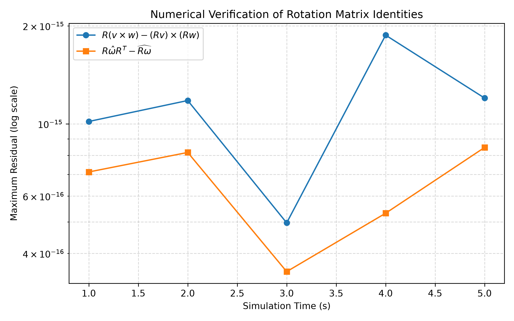

# HW1 — MuJoCo Rotation Sandbox & Analytical Solutions 🔄

**Course:** ME 639 (Introduction to Robotics) — IIT Gandhinagar  
**Author:** Prachi Jindal

---

## 📑 Contents

- **Part 1:** Analytical derivations and written solutions: [`Hw1_part1.pdf`](Hw1_part1.pdf)
- **Part 2:** MuJoCo 3D Rotation Sandbox, numerical verification of skew-symmetric identities, and ROS 2 TF broadcaster.

---

# HW1 Part 2 — MuJoCo Rotation Sandbox

Starter + completed code for ME 639 HW1, Part 2.
Demonstrates **current-frame** vs. **fixed-frame** rotation composition in MuJoCo,
and numerically verifies skew-symmetric matrix identities from Problem 5.

---

## ⚙️ Setup

```bash
python3 -m venv venv
source venv/bin/activate        # Windows: venv\Scripts\activate
pip install -r requirements.txt
```

Sanity-check the model loads and renders:

```bash
cd scripts
python 01_rotation_sandbox.py
```

You should see a small red/blue/green "dart" (an asymmetric body, so you can
always tell how it's oriented) sitting in the MuJoCo viewer, with its body
frame axes drawn on it (red=x, green=y, blue=z) and a fixed space frame drawn
faintly at the origin.

---

## 🗂️ Directory Structure

```
HW1/
│
├── model/
│   └── asymmetric_body.xml          # MJCF scene: asymmetric free body + axis markers
│
├── scripts/
│   ├── utils.py                     # Rotation helpers: hat, vee, Rx/Ry/Rz, quat ↔ R
│   ├── 01_rotation_sandbox.py       # Task 1: current-frame vs. fixed-frame composition
│   ├── 02_verify_skew_properties.py # Task 2: numerically verify Problem 5 identities (batch)
│   └── 02_verify_skew_properties_live.py  # Task 2: live viewer + residual plot
│
├── ros_ws/                          # ROS 2 workspace: TF broadcaster node
│   ├── README.md
│   └── src/hw01_tf_demo/
│
├── results/
│   └── q8_residual_plot.png         # Residual plot from Task 2 live script
│
├── videos/
│   └── Q7_rotation_demo.mp4         # Screen recording: current-frame vs. fixed-frame demo
│
├── Hw1_part1.pdf                    # Analytical solutions & written derivations
├── requirements.txt
├── AI_USE_NOTE.md
└── README.md
```

---

## 🔍 What Each Script Does

| Script | Task | Description |
|---|---|---|
| `utils.py` | — | Rotation utilities. Do **not** modify. |
| `01_rotation_sandbox.py` | 1 | Composes a sequence of elemental rotations in current-frame or fixed-frame mode and animates the dart in MuJoCo. Edit `rotation_sequence` and re-run to explore. |
| `02_verify_skew_properties.py` | 2 | Batch verification: advances simulation, checks $R(v \times w)=(Rv) \times (Rw)$ and $R \omega R^T=(R\omega)^\wedge$ at 5 logged timesteps. Prints a table of max residuals. |
| `02_verify_skew_properties_live.py` | 2 | Same checks with a live MuJoCo viewer and time-varying angular velocity. Saves `results/q8_residual_plot.png` when done. |

---

## 🚀 Running the Scripts

### Task 1 — Rotation order demo

```bash
cd scripts
python 01_rotation_sandbox.py
```

Edit `rotation_sequence` at the top of the file to switch between `"current"` and `"fixed"` frames and observe the different final orientations.

### Task 2 — Numerical identity verification (batch)

```bash
cd scripts
python 02_verify_skew_properties.py
```

Expected output (residuals at machine-epsilon level, ~1e-15):

```text
 step   t (s)    max resid: R(vxw)=(Rv)x(Rw)   max resid: RwR^T=(Rw)^
    0    1.000                        2.220e-16               2.960e-16
    1    2.000                        2.220e-16               2.960e-16
    ...
```

### Task 2 — Live viewer + residual plot

```bash
cd scripts
python 02_verify_skew_properties_live.py
```

Closes the viewer window to generate and save the residual plot.

---

## 🤖 Task 3 – ROS 2 TF Frame Visualization (Optional/Bonus)

Implemented a ROS 2 TF broadcaster that visualizes the difference between
current-frame and fixed-frame rotation composition in RViz2.

Two frames are broadcast:
- `space_frame`: fixed reference frame
- `body_frame`: rotating body frame

The ROS parameter `compose_frame` controls the rotation convention:

### Current-frame composition
$$R_{\text{new}} = R_{\text{old}} \cdot R_{\text{step}}$$

### Fixed-frame composition
$$R_{\text{new}} = R_{\text{step}} \cdot R_{\text{old}}$$

The parameter can be changed live while RViz2 is running:

```bash
ros2 param set /hw01_tf_broadcaster compose_frame current
```

---

## 📊 Results

### Residual Plot (Task 2)

Both identities hold to within floating-point precision (~1e-15) across all simulation timesteps:



---

## 🎥 Video Demo (Task 1)

`videos/Q7_rotation_demo.mp4` shows the same two-rotation sequence applied first in
**current-frame** mode and then in **fixed-frame** mode, producing visibly different
final orientations — confirming the non-commutativity of rotation composition.

---

## 📝 AI Use

See [`AI_USE_NOTE.md`](AI_USE_NOTE.md) for a full account of AI use per the course AI Use Policy.

---

## 📦 Dependencies

- Python 3.10+
- `mujoco >= 3.1`
- `numpy >= 1.24`
- `matplotlib >= 3.7`

Install with:

```bash
pip install -r requirements.txt
```
